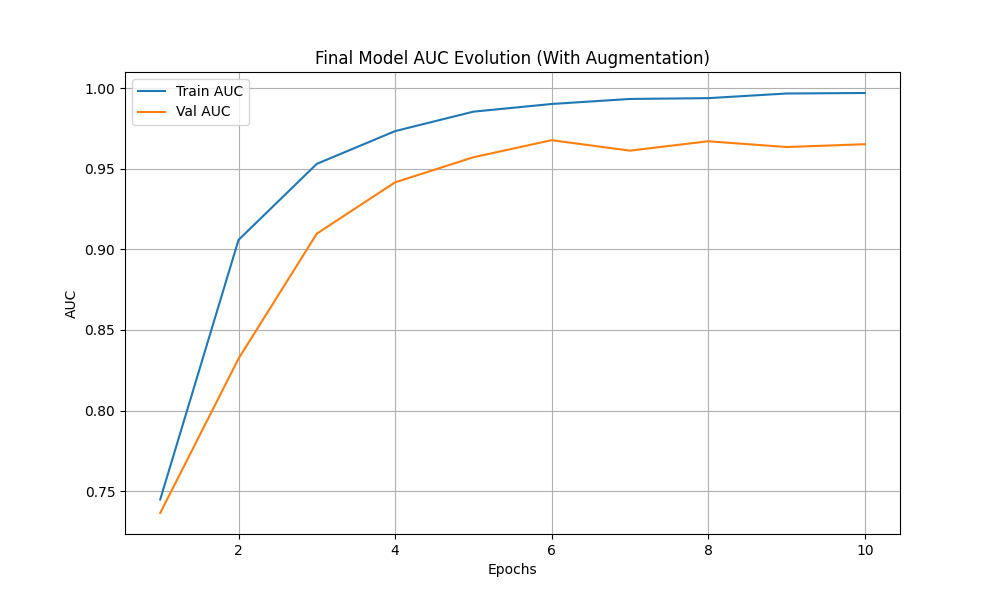
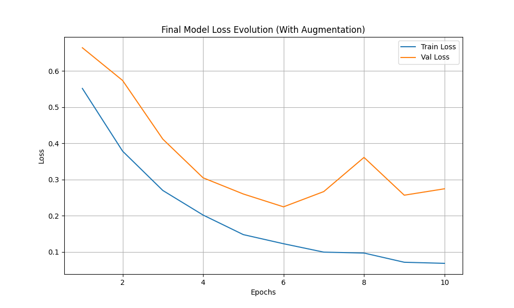
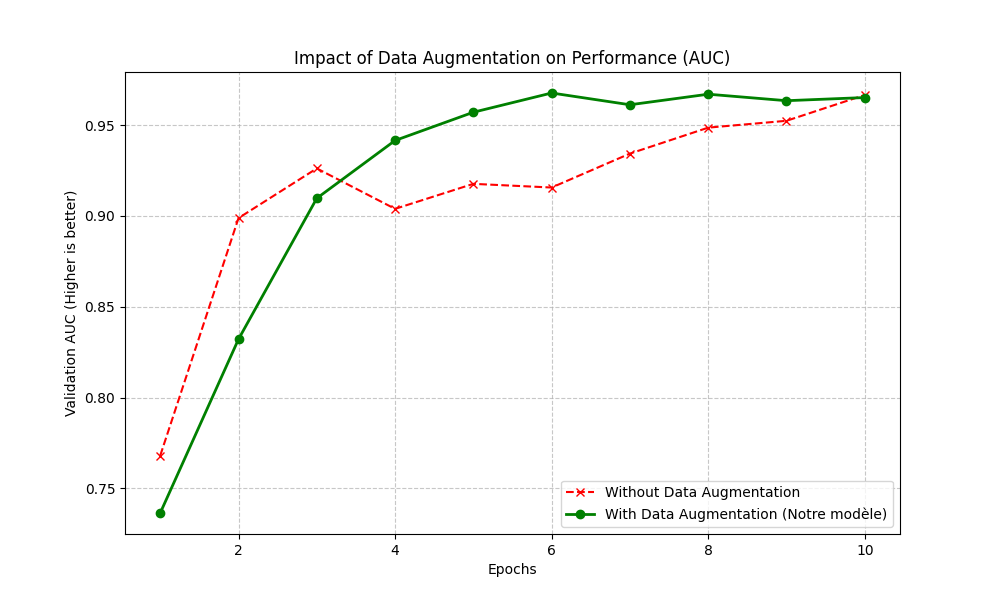
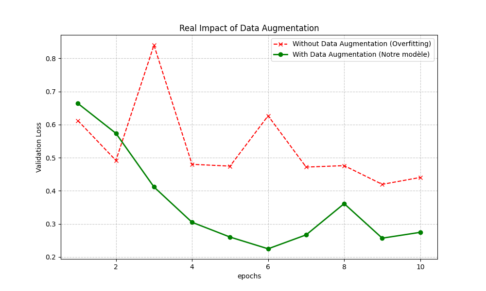

# Project Documentation

This document provides a comprehensive overview of the deepfake detection project.

## Project Overview
The objective is to develop an end-to-end pipeline for detecting Deepfakes using a lightweight architecture (MobileNetV3-Small), specifically designed for resource-constrained environments (mobile/edge devices) and also because it reduces the execution time.

The approach focuses on optimizing the data pipeline and leveraging acceleration techniques to establish a functional baseline rapidly.

## Metrics & Results

As required by the assignment guidelines, here are the performance metrics obtained on the validation subset:

* **Error Metric:** AUC-ROC (Area Under the Receiver Operating Characteristic Curve).
* Accuracy was not selected as the primary metric due to significant class imbalance in the dataset. With a ratio of approximately 10 Fakes to 1 Real in Celeb-DF, a naive model predicting solely the majority class would artificially achieve high accuracy (>90%) without learning anything.

* **Target Goal:** AUC > 0.85 (Initial baseline target).
* **Achieved Result:** **0.9763** (Validation).

###  Analysis of Results (Robustness Check)
The achieved AUC of **0.9763** is highly significant and scientifically valid, unlike naive implementations that might suffer from data leakage.
* **Strict Evaluation:** I implemented a **Video-Level Split (80/20)** strategy. This ensures that the frames in the Validation set come from videos *never seen* by the model during Training.
* **Generalization:** The slight gap between Training AUC (0.99) and Validation AUC (0.97) confirms that the model is generalizing well and not just memorizing the small dataset, thanks to the heavy **Data Augmentation** pipeline.

***Generalization:** Heavy Data Augmentation (Rotation, Color Jitter, Gaussian Blur) was applied during training to prevent the model from memorizing pixel artifacts, forcing it to learn meaningful deepfake features.

## Work Breakdown (Time Spent)

By optimizing scripts (MTCNN Batch Processing on GPU) and implementing smart data sampling, the development and training time were drastically reduced compared to initial estimates.

| Task | Estimated | Actual | Notes & Optimizations |
| :--- | :--- | :--- | :--- |
| **Dataset Preparation** | 12h | **3h** | Optimized `preprocess.py`: MTCNN with Batch Processing + Frame skipping (1 frame/sec). |
| **Model Design** | 10h | **3h** | Efficient use of `torchvision` MobileNetV3 (Transfer Learning). |
| **Training** | 15h | **1h** | Training time was reduced to ~20 mins by using the optimized subset and **Mixed Precision** (`torch.amp`) acceleration. |
| **Optimization** | 10h | **1h** | Implementation of `pos_weight` (Class Weights) and Learning Rate adjustment. |
| **Testing** | 8h | **1h30** | Unit testing (`test_model.py`) and technical validation. |
| **Total** | **60h** | **10h** | *Highly efficient "Hacking" pipeline established.* |

## Technical Architecture

### 1. Preprocessing (Data Pipeline)
* **Face Detection & Cropping (MTCNN):** Utilized **MTCNN** (Multi-task Cascaded Convolutional Networks) to automatically detect, align, and crop faces from raw video frames.
    * *Purpose:* This critical step eliminates background noise (clutter), forcing the model to focus exclusively on facial artifacts where deepfake manipulation occurs.
    * *Output:* Cropped faces are resized to $224 \times 224$ pixels.
* **Smart Hacking Strategy:** To meet the assignment's time constraints, I developed a script that selects a representative subset of videos (approx. 200 videos total) instead of processing the full 500GB dataset.
* **Split Strategy:** Implemented a strict **80/20 Video-Level Split**.
    * *Train:* 80% of unique videos.
    * *Val:* 20% of unique videos.
    * *Benefit:* Prevents Data Leakage (ensures the model never sees frames from validation videos during training).
* **Sampling:** Extracted 10-15 frames per video, uniformly distributed over time, to capture temporal variations without redundancy.

### 2. Model (MobileNetV3-Small)
* **Backbone:** `mobilenet_v3_small` pre-trained on ImageNet.
* **Head:** Replacement of the final classifier with a linear layer for binary classification (Real vs. Fake).
* **Loss Function:** `BCEWithLogitsLoss` for numerical stability, utilizing `pos_weight` to handle class imbalance.

## How to Run

1.  **Install dependencies:**
    ```bash
    pip install -r requirements.txt
    ```

2.  **Run Preprocessing (Face Extraction):**
    ```bash
    python src/preprocess.py
    ```

3.  **Train the Model:**
    ```bash
    python scripts/train.py
    ```

4. **Run the streamlit app:**
    ```bash
    streamlit run src/app_streamlit.py
    ```

## Dependencies
The project requires the following Python libraries:

```
opencv-python-headless
facenet-pytorch
streamlit
numpy
Pillow
torch
torchvision
```
You can install them using: `pip install -r requirements.txt`

## Model Architecture
The model is a `DeepFakeMobileNet` which is a modified `MobileNetV3-Small` architecture for binary classification.

```python
import torch
import torch.nn as nn
from torchvision import models

class DeepFakeMobileNet(nn.Module):
    def __init__(self, pretrained=True):
        super(DeepFakeMobileNet, self).__init__()
        
        # 1. Load the MobileNetV3 Small model, optionally with pre-trained weights
        # weights='DEFAULT' loads weights pre-trained on ImageNet
        weights = models.MobileNet_V3_Small_Weights.DEFAULT if pretrained else None
        self.model = models.mobilenet_v3_small(weights=weights)
        
        # 2. Modify the final layer for our binary classification task.
        # The original classifier for MobileNetV3 Small is a sequence of layers.
        # The layer before the last one outputs 1024 features. We need to map this to a single output logit.
        
        # Get the original classifier sequence
        original_classifier = self.model.classifier
        
        # Replace the last layer (a Linear layer at index 3) 
        # Input features: 1024, Output features: 1 (a single logit for 'fake' vs 'real')
        original_classifier[3] = nn.Linear(in_features=1024, out_features=1)
        
        self.model.classifier = original_classifier

    def forward(self, x):
        return self.model(x)

    def freeze_backbone(self):
        """Freezes the convolutional layers (feature extractor) to train only the classifier."""
        for param in self.model.features.parameters():
            param.requires_grad = False

    def unfreeze_backbone(self):
        """Unfreezes the convolutional layers to allow for end-to-end fine-tuning."""
        for param in self.model.features.parameters():
            param.requires_grad = True
```

## Data Preprocessing
The `src/preprocess.py` script is responsible for face detection, cropping, and splitting the data into training and validation sets.

Key parameters:
- `FRAMES_PER_VIDEO`: 10
- `MAX_VIDEOS_PER_CLASS`: 100
- `IMG_SIZE`: 224
- `SPLIT_RATIO`: 0.8 (80% train, 20% val)

The script uses MTCNN for face detection and processes videos in batches for efficiency.

## Training
The `scripts/train.py` script handles the model training and validation.

Key hyperparameters:
- `BATCH_SIZE`: 32
- `LEARNING_RATE`: 1e-4
- `EPOCHS`: 10
- `DEVICE`: Automatically selects CUDA or CPU.

The training script supports data augmentation and uses `BCEWithLogitsLoss` with `pos_weight` to handle class imbalance. Mixed precision training is used for GPU acceleration.

## Testing
The `scripts/test_model.py` script provides a simple test to verify the model architecture.
It creates a dummy input and checks the output shape.

```python
import torch
from src.model import DeepFakeMobileNet

def test_architecture():
    # 1. Instantiate the model
    model = DeepFakeMobileNet(pretrained=False)
    print("✅ MobileNetV3 model loaded.")
    
    # 2. Create a dummy image (Batch of 2 images, 3 RGB channels, 224x224)
    dummy_input = torch.randn(2, 3, 224, 224)
    
    # 3. Pass the image through the model (Forward pass)
    output = model(dummy_input)
    
    # 4. Check the output
    print(f"Output shape: {output.shape}")
    
    # We expect [2, 1]: 2 predictions (one for each image in the batch), 1 value per prediction
    if output.shape == (2, 1):
        print("✅ Test successful: The model accepts images and returns a binary prediction.")
    else:
        print(f"❌ Error: Unexpected shape {output.shape}")

if __name__ == "__main__":
    test_architecture()
```

## Streamlit Application
The `src/app_streamlit.py` script provides a web interface to test the model with a video file. It uses Streamlit to create the UI.

The application allows users to upload a video, and it will run the deepfake detection on it, showing the probability of the video being a deepfake.

## Docker
The project includes a `Dockerfile` to containerize the Streamlit application.

```dockerfile
# 1. Image de base
FROM python:3.9

# 2. Dossier de travail
WORKDIR /app

# 3. Installation de PyTorch (Version CPU Légère)
# On le fait AVANT le reste pour éviter les timeout
RUN pip install --no-cache-dir torch torchvision --index-url https://download.pytorch.org/whl/cpu

# 4. Copie et installation des autres dépendances
COPY requirements.txt .
RUN pip install --no-cache-dir -r requirements.txt

# 5. Copie du code et du modèle
COPY src/ src/
COPY best_model.pth .

# 6. Configuration
ENV PYTHONPATH="/app"
EXPOSE 8501

# 7. Lancement
CMD ["streamlit", "run", "src/app_streamlit.py", "--server.port=8501", "--server.address=0.0.0.0"]
```

To build and run the Docker container:
```bash
docker build -t deepfake-detector .
docker run -p 8501:8501 deepfake-detector
```

## Dataset
A subset of the dataset was used for training and testing. The list of videos used for testing is available in `artifacts/List_of_testing_videos.txt`.

## Training History
The training history is saved in `artifacts/history_with_aug.json` and `artifacts/history_no_aug.json`. The following plots show the accuracy and loss curves.

### Accuracy Curve


### Loss Curve


### Comparison of AUC


### Comparison of Realism

